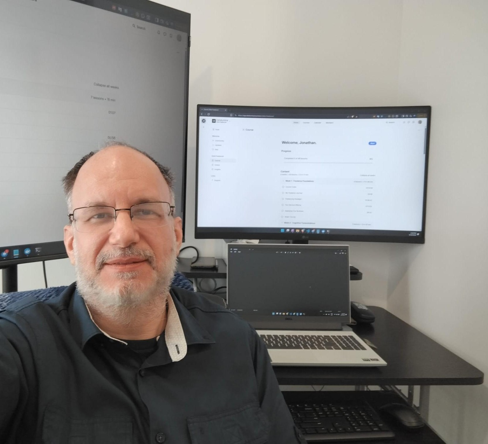

# About

You're here because something in your operations is broken, slow, or fragile, and you suspect the fix isn't another SaaS subscription.

I'm Jonathan Duncan, a freelance Software and AI Engineer with 25+ years building custom systems for businesses whose operations are too complex, too specific, or too interconnected for generic tools. My clients are CTOs, technical founders, and operations leaders who need architecture-level thinking paired with hands-on delivery, not just someone to write code to a spec.

I've seen a $1,500 invoice go unbilled because a job slipped through a Google Sheet. I've seen research teams waste weeks collecting data by hand. Those are the problems I build against.

## What I build

My core offer is **AI-integrated custom business automation systems**: bespoke platforms that replace manual, spreadsheet-driven workflows with production-grade systems designed for scale, accuracy, and long-term maintainability.

That can include:

- Workflow automation for admin-heavy or revenue-critical operations
- Full-stack custom platforms built around how the business actually runs
- Cloud-native systems on Azure and other major cloud platforms
- AI-enhanced workflows for document processing, intelligent extraction, and knowledge-based assistance
- RAG pipelines, API integrations, and orchestration across multiple systems
- Production data architecture using SQL Server, PostgreSQL, PostGIS, and Azure Cosmos DB

## Why clients hire me

-   🏢 **Consultative Development**

    ---

    I do not just build what is requested. I dig into the real problem first. Before writing code, I look at business constraints, scaling needs, cost implications, and what success actually needs to look like.

-   📊 **Business-Minded Technical Decisions**

    ---

    Good software is not just technically correct. It has to fit the business model, the operational reality, and the long-term cost structure. I design systems that work today and still make sense as the business grows.

-   🏗️ **Full-Stack Architecture Ownership**

    ---

    One person owns the entire stack and makes coherent decisions across it: enterprise .NET, Python data engineering, cloud infrastructure, geospatial systems, real-time applications, and AI integration.

-   🤝 **Long-Term Partnership**

    ---

    7 clients have returned for multiple engagements, including an ongoing 13-year partnership. I adapt when requirements change, budgets tighten, or priorities shift. The goal is sustained technical progress, not one-off delivery.

## I might not be a good fit if

- You need a team of 5+ developers working in parallel. I'm a senior solo engineer, not an agency
- The project has a fixed deadline under 4 weeks with undefined scope
- You're looking for the lowest hourly rate. I compete on outcomes, not price
- You need someone on-site full-time. I work remotely, async-first, with regular check-ins
- The project is a quick WordPress site or landing page. I build complex custom systems

## How I work in practice

Engagements follow a consistent pattern: I start with the real business problem (not a feature list), design a solution that fits your workflow and budget, build in phases with working software at each milestone, and communicate what's happening throughout.

Day-to-day: async-first with weekly written summaries and demo links, plus check-ins as needed. I'm direct about blockers and scope changes. No surprises on the invoice. Most clients say communication is the strongest part of working with me.

I adapt to your tools: Git, Jira, Slack, Teams, Linear, Azure DevOps. If your team has a workflow, I'll fit into it.

## Credibility

⏱️ 25+ Years Building Software
💰 $500K+ Delivered on Upwork
⭐ 100% Job Success Score
🏆 Top Rated Plus | Top 3%
📄 49+ Completed Contracts
🤝 7+ Repeat Clients

Selected examples of the work include:

- A [multi-tenant automotive diagnostics platform](portfolio/projects/case-study-automotive-platform.md) tied to QuickBooks reconciliation
- A [climate data pipeline](portfolio/projects/climate-data-pipeline.md) integrating 120+ government sources
- A [real-time file monitoring platform](portfolio/projects/real-time-file-monitoring.md) handling 100,000+ files across Azure File Shares
- A Canadian geocoding API processing millions of addresses with census enrichment
- A diagnostic visualization platform for multi-cylinder engine analysis

## Core technologies

  

:material-language-csharp:{ .tech-grid__icon }
C# / .NET
  

  

:simple-python:{ .tech-grid__icon }
Python
  

  

:material-microsoft-azure:{ .tech-grid__icon }
Azure
  

  

:simple-postgresql:{ .tech-grid__icon }
PostgreSQL
  

  

:simple-docker:{ .tech-grid__icon }
Docker
  

  

:simple-terraform:{ .tech-grid__icon }
Terraform
  

  

:simple-fastapi:{ .tech-grid__icon }
FastAPI
  

  

:material-brain:{ .tech-grid__icon }
OpenAI / LLMs
  

  

:simple-googlecloud:{ .tech-grid__icon }
GCP
  

  

:material-aws:{ .tech-grid__icon }
AWS
  

ASP.NET Core
Blazor
WPF
SQL Server
Azure Cosmos DB
PostGIS
pgvector
RAG Pipelines
Apache Airflow
Clean Architecture

Full stack details, including Blazor, WPF, PostGIS, pgvector, Apache Airflow, pandas, and CI/CD tooling, are available on request or in [project case studies](portfolio/index.md).

**Languages:** English (Native), French (Native), Spanish (Fluent)

[View all services & pricing :material-arrow-right:](services.md){ .md-button }
[Read client testimonials :material-arrow-right:](testimonials.md){ .md-button }

### Want to discuss your project?

Book a free 30-minute strategy call. I will ask the right questions, give you direct feedback, and help you figure out the most sensible next step.

[Book a Free Strategy Call :material-arrow-top-right:](https://cal.com/jonathanduncan/free-consultation){ .md-button .md-button--primary }
[or email me directly :material-email:](mailto:jonathan@jonathanduncan.pro){ .md-button }

