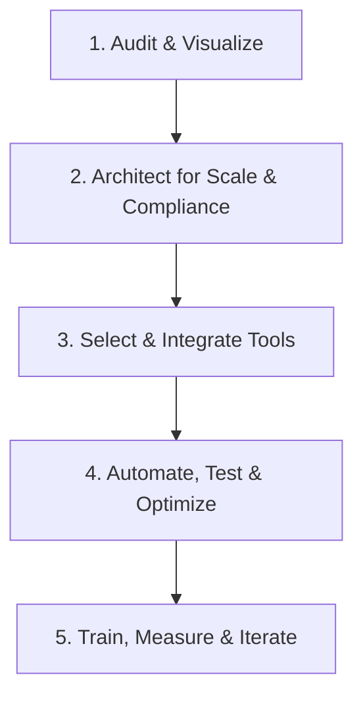

<!--
Title: Workflow Automation: How to Create Solutions That Save Time & Revenue
Meta Description: Learn how to create workflow automation solutions that save time and recover lost revenue for small businesses, with a proven, step-by-step process, real case study, and actionable guide.

-->

<!-- Open Graph / Facebook -->
<meta property="og:type" content="article" />
<meta property="og:title" content="Workflow Automation: How to Create Solutions That Save Time & Revenue" />
<meta property="og:description" content="Learn how to create workflow automation solutions that save time and recover lost revenue for small businesses, with a proven, step-by-step process, real case study, and actionable guide." />
<meta property="og:image" content="https://jonathanduncan.pro/assets/vitaly-gariev-8qQaWOBfiV0-unsplash.jpg" />
<meta property="og:url" content="https://jonathanduncan.pro/blog/workflow-automation-create-solutions-save-time-revenue" />

<!-- Twitter -->
<meta name="twitter:card" content="summary_large_image" />
<meta name="twitter:title" content="Workflow Automation: How to Create Solutions That Save Time & Revenue" />
<meta name="twitter:description" content="Learn how to create workflow automation solutions that save time and recover lost revenue for small businesses, with a proven, step-by-step process, real case study, and actionable guide." />
<meta name="twitter:image" content="https://jonathanduncan.pro/assets/vitaly-gariev-8qQaWOBfiV0-unsplash.jpg" />

> **Answer First:**  
> Small businesses lose 3–7% of revenue and up to 40% of admin time to manual processes and disconnected tools. My expert, evidence-based workflow automation process—proven case studies—recovers lost profits and owner time, delivering measurable ROI in as little as 30 days.

## Author & Credentials

**Jonathan Duncan**  
Software & AI Engineer | 15+ years in custom platform design for SMBs  
$500K+ Earnings on Upwork | Top Rated Plus | 100% Job Success

---

## Key Stats 

- **3–7%** of SMB revenue lost to process inefficiency ([LedgerUp, 2025](https://www.ledgerup.ai/resources/the-top-5-best-saas-invoicing-and-contract-to-cash-platforms-that-prevent-revenue-leakage-2025))
- **20–40%** of admin time wasted on manual tasks ([Workday, 2025](https://blog.workday.com/en-us/top-automation-ideas-to-streamline-your-small-business.html))
- **1–3 months** to positive ROI after automation (internal case studies, 2025–2026)

## Table of Contents

- [Author & Credentials](#author--credentials)
- [Key Stats](#key-stats)
- [Why Revenue & Time Leak in SMBs](#why-revenue--time-leak-in-smbs)
- [Discovery: Diagnose Before Automating](#discovery-diagnose-before-automating)
- [Mapping & Visualizing Workflows](#mapping--visualizing-workflows)
- [Step-by-Step Implementation](#step-by-step-implementation)
    - [1. Audit & Visualize](#1-audit--visualize)
    - [2. Architect for Scale & Compliance](#2-architect-for-scale--compliance)
    - [3. Select & Integrate Tools](#3-select--integrate-tools)
    - [4. Automate, Test & Optimize](#4-automate-test--optimize)
    - [5. Train, Measure & Iterate](#5-train-measure--iterate)
- [Why Iterative, Business-First Automation Wins](#why-iterative-business-first-automation-wins)
- [Results & Case Study](#results--case-study)
- [Key Stats (2026 Freshness)](#key-stats-2026-freshness)
- [Discovery: Diagnosing Before Automating](#discovery-diagnosing-before-automating)
- [Frequently Asked Questions (FAQ)](#frequently-asked-questions-faq)

---

## Why Revenue & Time Leak in SMBs

**Fact:**  
Manual processes, spreadsheet errors, and disconnected tools are the silent killers of small business efficiency. They cause missed invoices, delayed approvals, and lost revenue—typically 3–7% of annual turnover ([LedgerUp, 2025](https://www.ledgerup.ai/resources/the-top-5-best-saas-invoicing-and-contract-to-cash-platforms-that-prevent-revenue-leakage-2025)). Admins spend 20–40% of their time on repetitive, non-billable tasks ([Workday, 2025](https://blog.workday.com/en-us/top-automation-ideas-to-streamline-your-small-business.html)). The root cause? Lack of visibility and systems tailored to real business operations.

Let’s be honest: nobody wakes up excited to chase down invoices or untangle spreadsheet spaghetti. If you’re still using Excel as your billing system, I have bad news (and a better way). And yes, I’ve seen it all—one client’s “workflow” was basically a game of email ping-pong. Spoiler: they weren’t winning.

> **Visual:**  
> 

Real talk: If your “system” involves sticky notes, a whiteboard, and a prayer, you’re not alone. But you are leaking money. (And if you’re reading this and thinking, “But my process is special,” congratulations—you’re right. It’s especially likely to break at 5pm on a Friday.)
## Discovery: Diagnose Before Automating

**Expert Insight:**  
Automation only delivers ROI when it targets real, high-impact pain points. Begin with a structured discovery phase—interviewing stakeholders, mapping current workflows, and quantifying leakage.

**Top 10 Discovery Questions:**
1. Why automate now?
2. What does your business do?
3. Who is your main user?
4. What action do you want users to take?
5. What’s happening today instead?
6. What works/doesn’t work now?
7. What does success look like?
8. Must-have vs. nice-to-have features?
9. Who manages the system after launch?
10. What’s your budget and timeline?

---

## Mapping & Visualizing Workflows

A clear, visual map of your current processes is the foundation for automation. Auditing each step exposes bottlenecks and leakage points, setting measurable goals (e.g., 80% admin reduction, zero missed invoices).

| Workflow Element      | Current Pain Point         | Leakage Risk           | Automation Opportunity      | Priority  |
|----------------------|---------------------------|------------------------|----------------------------|-----------|
| Quote-to-Cash        | Manual invoicing, duplicate entry | Missed/late billing, revenue loss | Auto-invoice, CRM sync, approval gates | High      |
| Client Onboarding    | Email ping-pong, unclear steps    | Delayed revenue, lost clients    | Guided forms, automated task triggers  | High      |
| Usage/Service Tracking | Spreadsheet/manual updates      | Missed charges, unbilled work    | Real-time tracking, auto-logging       | High      |
| Approvals & Handoffs | Email/Slack bottlenecks          | Delays, errors, lost info        | Automated routing, notifications       | Medium    |
| Reporting & Compliance | Manual report prep, data silos  | Inaccurate KPIs, audit risk      | Auto-reporting, dashboard integration  | Medium    |
| Admin Tasks          | Repetitive data entry            | Wasted time, human error         | Workflow automation, AI suggestions    | Medium    |

---

## Step-by-Step Implementation

### 1. Audit & Visualize

- Interview stakeholders, document every workflow step
- Use diagrams to reveal bottlenecks and errors
- Quantify lost revenue and time with real data

### 2. Architect for Scale & Compliance

- Design modular, scalable workflows with clear documentation
- Plan for peak loads, security, and compliance
- Embed revenue safeguards (auto-invoicing, approval gates)

### 3. Select & Integrate Tools

- Choose platforms blending no-code and code extensibility (e.g., Activepieces, n8n, Chargebee)
- Start with high-impact integrations (CRM to billing)
- Use APIs for legacy systems, add AI for error reduction

### 4. Automate, Test & Optimize

- Pilot automation on highest-ROI workflows (e.g., invoice generation)
- Build in notifications, retries, human review gates
- Test against baseline metrics, iterate for improvement

### 5. Train, Measure & Iterate

- Provide hands-on training and intuitive interfaces
- Monitor KPIs (revenue recovery, admin time saved) via dashboards
- Continuously audit, version, and expand workflows

---

---

## Why Iterative, Business-First Automation Wins

Top-performing businesses don’t try to automate everything at once. They start with the highest-leakage process, deploy a rapid MVP, and expand only as each new feature proves its value. This approach saves money, reduces risk, and ensures every investment is justified by measurable results.

**Start Small, Deliver Value Fast:**  
Top-performing businesses don’t try to automate everything at once. They start with the highest-leakage process, deploy a rapid MVP, and expand only as each new feature proves its value. This approach saves money, reduces risk, and ensures every investment is justified by measurable results.

| Approach                | Iterative, Business-First         | Big Bang, All-at-Once         |
|-------------------------|-----------------------------------|-------------------------------|
| Initial Investment      | Low, focused on MVP               | High, large upfront cost      |
| Time to Value           | Weeks (fast ROI)                  | Months (delayed ROI)          |
| Risk Level              | Low (failures are small/contained)| High (failures are costly)    |
| Flexibility             | High (adapt as you learn)         | Low (hard to pivot)           |
| Stakeholder Buy-In      | Grows with each win               | Harder to maintain            |
| Expansion Path          | Data-driven, proven steps         | Guesswork, risky scaling      |

**Track, Invoice, and Optimize:**  
Build systems that make it easy to track work, ensure nothing falls through the cracks, and guarantee everything gets invoiced. Use existing SaaS or bookkeeping tools where they fit; only invest in custom solutions when off-the-shelf options can’t solve your unique challenges.

**Custom Solutions for Unique Problems:**  
When requirements are unique and existing platforms fall short, custom development is the answer. With 25+ years building production software, I specialize in one-off solutions using .NET, Azure, and Python—automating manual processes and incorporating AI where it genuinely adds value.

**Consultative, Business-Minded Development:**  
I dig into your business model, monetization, scalability, and ongoing costs. My experience lets me spot issues you might not see yet: multi-user concurrency, cost optimization, and integration challenges. I design systems that work today and scale tomorrow.

**Long-Term Partnership:**  
Clients often start with one project and expand to many. I adapt to budget constraints, pivot when requirements change, and maintain momentum through uncertainty. You’re not just hiring a coder—you’re gaining a strategic technical partner.

---

<em>Smart automation: save time, save money, and focus on what matters most.</em>

---

## Results & Case Study

**What to Expect:**  
- 3–7% revenue recovery from missed/delayed billing ([LedgerUp, 2025](https://www.ledgerup.ai/resources/the-top-5-best-saas-invoicing-and-contract-to-cash-platforms-that-prevent-revenue-leakage-2025))
- Owner time freed for growth and client work
- Scalable, future-proof operations

**Case Study (2025–2026):**  
A mobile diagnostics business mapped its workflow, exposing missed billing and admin bottlenecks. A custom platform eliminated thousands in lost revenue monthly and slashed admin time from hours to minutes. Off-the-shelf tools failed; only a structured audit revealed the right solution. The new platform now powers other businesses as SaaS, with measurable gains in revenue and owner freedom.  
See: [Automotive Platform Case Study](../Automotive-Platform-Case-Study.md)

---

## Key Stats (2026 Freshness)

- **3–7%** of small business revenue is lost to process inefficiency ([LedgerUp SaaS Invoicing, 2025](https://www.ledgerup.ai/resources/the-top-5-best-saas-invoicing-and-contract-to-cash-platforms-that-prevent-revenue-leakage-2025))
- **20–40%** of admin time is wasted on manual tasks ([Workday, 2025](https://blog.workday.com/en-us/top-automation-ideas-to-streamline-your-small-business.html))
- Most businesses see ROI within **1–3 months** of automation rollout (internal case studies, 2025–2026)

---

## Discovery: Diagnosing Before Automating

Before building any automation, I use a structured discovery process to understand your business, goals, and constraints. This ensures we solve the right problems and maximize ROI.

  

    <strong>My Framework Covers:</strong>
    <ul>
      <li>Business context & motivation</li>
      <li>Current state & bottlenecks</li>
      <li>Desired outcomes & success criteria</li>
      <li>Feature & scope definition</li>
      <li>Technical & operational considerations</li>
      <li>Constraints & logistics</li>
      <li>ROI & value assessment</li>
    </ul>
  

  

    <strong>Top 10 Discovery Questions:</strong>
    <ol>
      <li>Why automate now?</li>
      <li>What does your business do?</li>
      <li>Who is your main user?</li>
      <li>What action do you want users to take?</li>
      <li>What’s happening today instead?</li>
      <li>What works/doesn’t work now?</li>
      <li>What does success look like?</li>
      <li>Must-have vs. nice-to-have features?</li>
      <li>Who manages the system after launch?</li>
      <li>What’s your budget and timeline?</li>
    </ol>
  

---

**Why My Approach Works:**
I don’t just automate for the sake of automation. I help you pinpoint where you’re losing money or time, so you can build systems around the real pain points. My process is consultative and iterative: start with the highest-impact, lowest-hanging fruit, deliver a rapid MVP, and expand only as needed. This lets you see results fast, avoid unnecessary expense, and ensure every feature is actually useful before investing further. If off-the-shelf tools or SaaS features can solve your problem, I recommend them. But when your needs are unique, I design and build custom solutions that don’t exist yet—so you get exactly what your business requires, not just what’s available.

## Frequently Asked Questions (FAQ)

**Q1: Which workflows should I automate first?**  
Map all processes and identify where the most time or revenue is lost—usually manual invoicing, approvals, or data entry. Prioritize high-leakage, repetitive tasks.

And if you’re wondering, “Will this actually work for my business?”—well, unless your business model is ‘lose money and enjoy chaos,’ yes. (If it is, call me anyway. I love a challenge.)

**Q2: What tools do you recommend?**  
Platforms like Activepieces and n8n balance no-code simplicity with code extensibility, integrating with legacy systems via APIs.

**Q3: How quickly will I see results?**  
Most businesses see 20–40% admin time reduction and 3–7% revenue recovery within 1–3 months of implementation.

---

Need something custom built for a complex workflow?

Schedule a free 30-minute strategy call and I will help you map the right technical approach for your business constraints and growth goals.

[Book a Free Strategy Call :material-arrow-top-right:](https://cal.com/jonathanduncan/free-consultation){ .md-button .md-button--primary }
[or email me directly :material-email:](mailto:jonathan@jonathanduncan.pro){ .md-button }

---

**Sources:**  
- [LedgerUp SaaS Invoicing](https://www.ledgerup.ai/resources/the-top-5-best-saas-invoicing-and-contract-to-cash-platforms-that-prevent-revenue-leakage-2025)  
- [Lineup Revenue Leakage Guide](https://lineup.com/how-publishers-can-reduce-revenue-leakage-a-practical-guide/)  
- [Automotive Platform Case Study](../Automotive-Platform-Case-Study.md)  
- [Workday: Top Automation Ideas for Small Business](https://blog.workday.com/en-us/top-automation-ideas-to-streamline-your-small-business.html)

---

