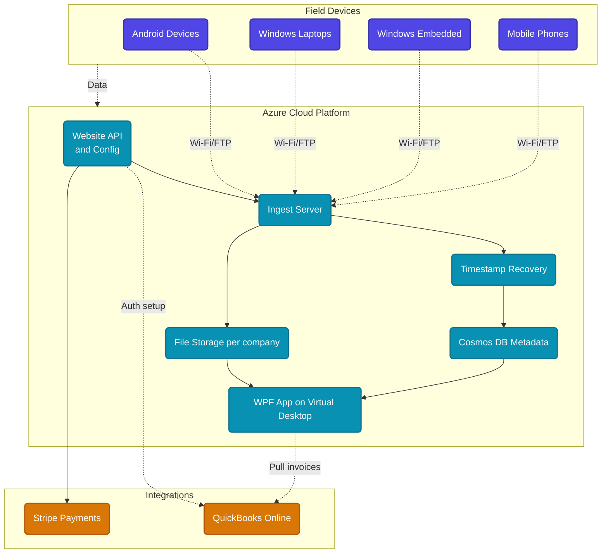

# From Buried in Paperwork to Back in the Field

**Automating an Automotive Diagnostics Operation**

!!! abstract "Project Snapshot"
    **Client type:** Mobile automotive diagnostics company  
    **Project type:** Custom multi-tenant SaaS platform  
    **Stack:** WPF, ASP.NET Core (Razor Pages + Web API), Cosmos DB, Entity Framework Core, Azure, QuickBooks API, Stripe  
    **Role:** Sole developer — architecture, build, and deployment  
    **Timeline:** Phased delivery since Oct 2024 (ongoing)

**181K+** files indexed | **92** jobs/month | **6** SaaS subscriptions | **$400+/mo** in replaced tools

## Challenge

The client runs a mobile automotive diagnostics business. Technicians travel to shops and dealerships, using diagnostic scanners to inspect vehicles — capturing screenshots, photos, and PDF reports on their field devices.

Before the platform, the business was a one-person operation with two technicians. The owner was spending so much time on paperwork — manually gathering files from devices, building reports in Google Sheets, tracking jobs, matching scans to invoices — that he couldn't go out on jobs himself.

The technical problems ran deep:

- **Corrupted timestamps.** When files transferred from field devices to the server, the original modification dates were overwritten with the transfer date. That meant related files from a single job couldn't be reliably grouped together.
- **Multiple scanner formats.** Diagnostic PDFs came from different manufacturers — Autel, Snap-on, Launch, and others — each producing a different PDF structure. No single parser could handle them all.
- **Invisible revenue leakage.** With no connection between completed scans and invoices, jobs were falling through the cracks. One documented example: a $1,500 job went unbilled in a single month.
- **$400+/month in tools that didn't fit.** The client was paying for off-the-shelf SaaS products that still couldn't match the actual workflow of a mobile diagnostics operation.

## Goal

Free the owner from admin work so he could get back in the field. Automate the entire path from field device to job report to invoice — built around how the business actually operates, not how a generic tool assumes it should.

## Approach

I designed and built a custom platform that automates the full diagnostic workflow end-to-end:

- **File sync with timestamp preservation** — Files from field devices sync automatically over Wi-Fi or FTP. The system recovers original file dates from three sources (filenames, embedded metadata, and XML sidecar files) so related files can be grouped by job.
- **Multi-format PDF parsing** — Custom extraction logic handles 4+ distinct scanner PDF formats, pulling job dates, VIN numbers, vehicle details, and customer information.
- **OCR on images and rasterized PDFs** — VIN numbers are extracted from photos, screenshots, and non-text PDFs automatically, enabling the system to match files to jobs without manual searching.
- **Automated report generation** — Branded PDF reports are assembled from client-designed templates. The admin selects the source PDF, technician, shop, and services — the system generates the final report. A typical job pulls together 2–20 files (PDFs and images), reorders them, merges them into a single compressed PDF.
- **Three-way VIN reconciliation** — The system matches VIN numbers across scanner PDFs, job records, and QuickBooks invoices. Unmatched records surface immediately so nothing falls through the cracks.
- **Diagnostic overlay engine** — Custom-built tool that overlays engine sensor graphs from 2-cylinder to 16-cylinder configurations, aligning and color-coding each trace so misaligned cylinders are immediately visible.
- **Annotation and markup tools** — Built directly into the app for drawing, writing, and marking up any PDF or image before final report assembly.
- **Technician commission reporting** — Weekly commission breakdowns supporting both flat-rate-plus-commission and base-vs-commission pay models, broken down by job and service type.
- **Multi-tenant SaaS architecture** — Clean data isolation from day one. Multiple companies now use the same platform with fully separated files, data, and configuration.

## Key Architecture Decisions

- **WPF on Azure Virtual Desktop** — The client needed a Windows application accessible from Windows, Mac, and Android devices. Deploying via Azure Virtual Desktop means all files and processing happen in the cloud, not on the end-user's device.
- **Cosmos DB for file metadata indexing** — A file watcher monitors incoming files and stores metadata in a high-speed indexed database. This avoids expensive full re-scans on every check — only new files are processed incrementally.
- **Multi-tenant from day one** — The platform was designed clean for multi-tenancy from the start, not retrofitted. Each company's files, data, and configuration are fully isolated. Zero data leakage issues.
- **ASP.NET Core website for account management** — A separate web app handles company signup, Stripe billing, device sync configuration, FTP credentials, and QuickBooks OAuth setup.
- **Phased delivery** — Built incrementally over four phases: file sync and job creation → QuickBooks reconciliation → multi-tenant SaaS → technician commission tracking. Each phase delivered working production value before the next began.

### Architecture Overview

Architecture description (text alternative)

Field devices (Android, Windows laptops, Windows embedded, mobile phones) sync data over Wi-Fi or FTP to an Ingest Server running on Azure. The Ingest Server performs timestamp recovery, stores file metadata in Cosmos DB, and writes files to per-company File Storage. A WPF application running on Azure Virtual Desktop reads from both Cosmos DB and File Storage. The Website API and Config service feeds the Ingest Server, connects to QuickBooks Online for OAuth setup, and handles Stripe Payments. The WPF App pulls invoices from QuickBooks Online.

## Outcomes

- **Owner back in the field.** The business owner went from being stuck doing paperwork to working alongside his technicians again. The business has since grown beyond the original team.
- **181K+ files indexed** and searchable across all subscriptions, with ~652 new files ingested automatically per week.
- **~92 jobs processed per month** through the platform for the primary client alone.
- **Missed billing eliminated** through automated three-way VIN reconciliation — every scan is matched to a job and every job to an invoice.
- **$400+/month in previous tools replaced** by a purpose-built platform that actually fits the workflow.
- **Productized into SaaS** — the client's idea to offer the tool to other diagnostic businesses. Currently 6 active subscriptions with 1–3 technicians and 1–8 devices each.
- **Zero data leakage** across tenants since launch.

!!! tip "What this demonstrates"
    - Building a custom platform when off-the-shelf tools can't match the workflow
    - Solving hard technical problems: timestamp preservation across device types, cross-format OCR, multi-source VIN matching
    - Designing for productization from day one with multi-tenant architecture
    - Aligning engineering decisions with revenue outcomes — reconciliation directly protects billing integrity
    - Phased delivery that puts working software in production at every stage

## Technologies

WPF
ASP.NET Core
Razor Pages
Web API
Cosmos DB
Entity Framework Core
Azure
Azure Virtual Desktop
QuickBooks API
Stripe
PDF Processing
OCR
Image Processing

## Client Feedback

> "Your work has completely changed my life, and I thank you for that."
>
> "This is better than I could have possibly imagined."
>
> "Jonathan is absolutely incredible. I have yet to give him a hurdle he can't clear. He is competent, capable, conscientious, and creative."
>
> — Scot Nichols

### Need a custom platform for a complex workflow?

If your team is still managing critical operations through manual handoffs and disconnected tools, let's map a system that fits how your business actually runs.

[Book a Free Discovery Call :material-arrow-top-right:](https://cal.com/jonathanduncan/free-consultation){ .md-button .md-button--primary }
[View all projects :material-arrow-right:](../index.md){ .md-button }

<small class="text-muted">Project details shared with client permission. Some details generalized for confidentiality.</small>
