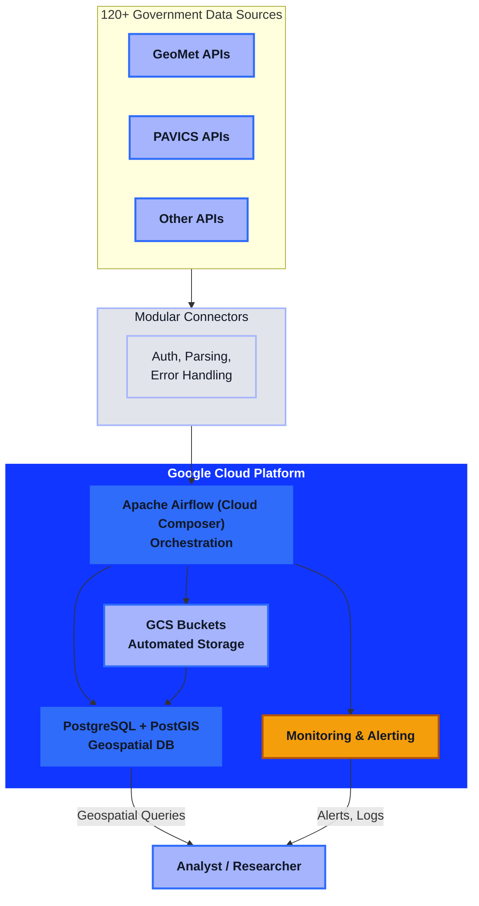

# Climate Data Pipeline and Integration Platform

!!! abstract "Project Snapshot"
    **Client type:** Climate research organization  
    **Project type:** Automated data pipeline and integration platform  
    **Stack:** Python, Apache Airflow (Cloud Composer), PostgreSQL/PostGIS, GCP  
    **Role:** Sole developer — architecture, build, and deployment  
    **Timeline:** 3.5+ years of continuous delivery and expansion

## Challenge

A leading Canadian climate research organization was drowning in manual data collection. With over 120 government sources (GeoMet & PAVICS), each using different APIs, authentication, and data formats, analysts spent weeks wrangling data instead of delivering insights. The lack of automation meant slow updates, high error rates, and no scalable way to add new sources—putting critical research and operational decisions at risk.
 
## Goal

Deliver a fully automated, production-ready data pipeline that could ingest, normalize, and unify 120+ government data sources, handle source instability, and support advanced geospatial queries—freeing analysts to focus on research, not wrangling.

## System Architecture

<strong>Accessibility & Theming:</strong> Diagram colors use extracted CSS tokens for brand consistency and contrast. For dark/light mode, colors adapt via <code>extra.css</code>. 
<strong>Mobile:</strong> If the diagram overflows, swipe horizontally to view all nodes. For best experience, rotate your device to landscape.
<strong>Responsive:</strong> On mobile, scroll horizontally to view the full diagram.

## Approach

I designed and implemented a robust, modular pipeline architecture built for scale and operational resilience:

- **Enterprise-Grade Cloud Architecture:** Deployed on Google Cloud Platform using Apache Airflow (Cloud Composer) for orchestration.
- **Modular Connector Framework:** Pluggable connectors for each data source, handling unique auth, parsing, and error recovery.
- **Automated Infrastructure:** Timestamped bucket creation, collision avoidance, and lifecycle policies for robust data management.
- **Zero-Downtime Deployments:** PowerShell and Python scripts for consistent, reliable releases.
- **Comprehensive Monitoring:** Integrated alerting, retry policies, and dead-letter queues for operational resilience.
- **Spatial Data Support:** PostgreSQL + PostGIS for advanced geographic queries.

## Key Architecture Decisions

- **Airflow orchestration** for managing complex, interdependent pipelines and operational visibility.
- **Per-source modular connectors** to handle high variation across 120+ inputs.
- **Observability-first design** so failures are surfaced early, not hidden.
- **PostGIS data model** to support geospatial use cases natively.

## Outcomes

- **120+ government sources integrated** into a single, normalized platform (GeoMet: 99, PAVICS: 20+)
- **Data collection time reduced** from weeks to hourly automation
- **Analyst productivity unlocked:** Time spent on manual collection now redirected to high-value research
- **Zero-downtime deployments and robust error recovery**
- **Operational reliability:** 24/7 system uptime, comprehensive monitoring, and rapid onboarding for new team members
- **Long-term partnership:** 3.5+ years of continuous delivery and feature expansion

!!! tip "What this demonstrates"
    - Building production data systems where off-the-shelf ETL abstractions break down
    - Translating fragmented public data into a reliable operational asset
    - Designing for long-term maintainability as source systems evolve

### Before & After

| Metric                   | Before (Manual)         | After (Automated)                |
|--------------------------|-------------------------|----------------------------------|
| Data source integration  | Weeks per source        | 120+ sources, modular connectors |
| Data freshness           | Manual, ad-hoc          | Automated, hourly to monthly     |
| Geographic querying      | Not available           | Full PostGIS support             |
| Data access              | None                    | Fully searchable for internal use|

### Need to unify data from many unreliable sources?

If your team is still spending time stitching together fragmented data manually, I can help you design a pipeline that is stable, maintainable, and built for scale.

[Book a Free Discovery Call :material-arrow-top-right:](https://cal.com/jonathanduncan/free-consultation){ .md-button .md-button--primary }
[View all projects :material-arrow-right:](../index.md){ .md-button }

<small style="opacity: 0.6;">Project details shared with client permission. Some details generalized for confidentiality.</small>
