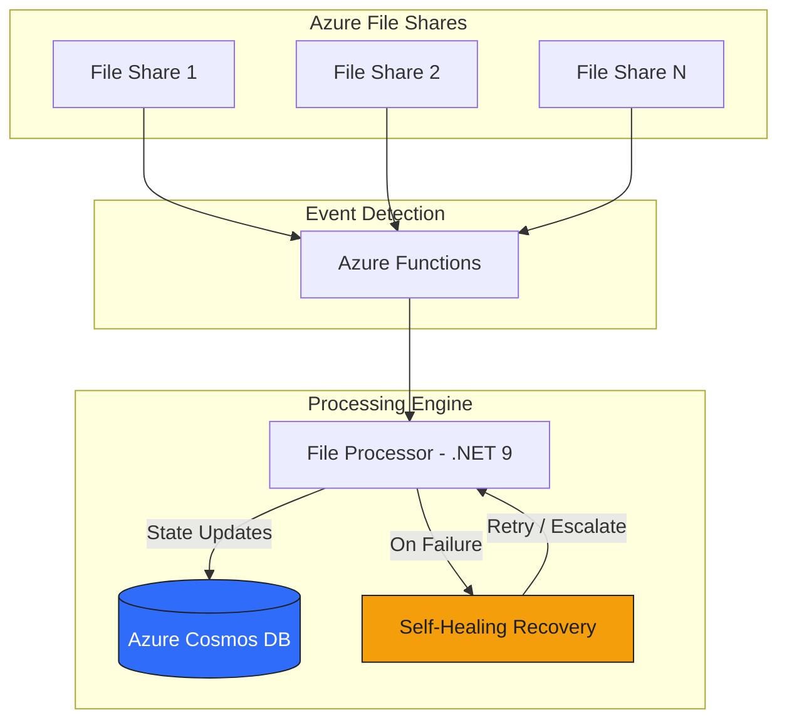

# Real-Time File Monitoring System: 100,000+ Files

## The Challenge

Automotive diagnostic operations depended on real-time access to massive file repositories—over 100,000 files across distributed Azure File Shares. Manual scanning took 10–15 minutes, causing critical delays for technicians and customer service. The legacy batch approach couldn’t keep up with the scale, lacked automatic recovery from failures, and provided poor operational visibility. For a business where every minute counts, these bottlenecks directly impacted customer satisfaction and operational costs.

## Our Approach

We architected an enterprise-grade .NET 9.0 monitoring service with intelligent Azure cloud integration, designed for scale, resilience, and real-time performance:

- **Real-time file event detection** using Azure Functions and FileSystemWatcher, eliminating polling delays.
- **Centralized state tracking** in Azure Cosmos DB, recording every file’s lifecycle with optimized partitioning for high throughput.
- **Self-healing error recovery** with automatic retries, no manual intervention required for common failures.
- **Comprehensive logging and monitoring** via Serilog and Application Insights, providing full operational visibility.
- **Production deployment** on Azure VM with enterprise-grade security.

### Architecture Overview

## Results & Impact

- **95% faster file discovery:** Reduced from 10+ minutes to 30 seconds 
- **100,000+ files processed** with zero performance degradation
- **1000+ file events per minute** handled during peak operations
- **99.9% uptime** achieved through robust error handling and self-healing
- **Near-zero detection latency:** Files processed as events occur, not on batch schedules
- **Significant reduction in administrative overhead** and faster diagnostic turnaround times

### Before & After

| Metric                     | Before (Batch Processing)         | After (Real-Time Service)        |
| -------------------------- | --------------------------------- | -------------------------------- |
| **Detection latency**      | 10–15 minutes (manual scan)       | 30 seconds (real-time)           |
| **Failure recovery**       | Manual investigation/reprocessing | Automatic self-healing           |
| **Operational visibility** | Manual checks per storage account | Centralized dashboard/logging    |
| **Scale**                  | Limited by scan duration          | 100,000+ files, 1000+ events/min |
| **Human intervention**     | Required for every failure        | Only for novel/persistent issues |

## Client Testimonial

> "This is incredible and just what the doctor ordered. Thank you soooo much for your help, this is gonna be a game changer for me. This is SOOO much faster. I just can't overstate how amazing this is. Worth every penny!"
> 
> — Scot Randal 

## Tech Stack

- .NET 9.0, C#
- Azure Cosmos DB
- Azure File Shares (SMB 3.0)
- Entity Framework Core
- Serilog
- Application Insights
- Azure VM

## Key Takeaways

- **Real-time automation unlocks operational excellence:** Eliminating manual scanning and batch delays delivers immediate business value.
- **Self-healing architecture reduces support burden:** Automatic recovery means less downtime and fewer escalations.
- **Scalable cloud design supports future growth:** Cosmos DB and Azure integration ensure the system can handle increasing volume without re-architecture.

