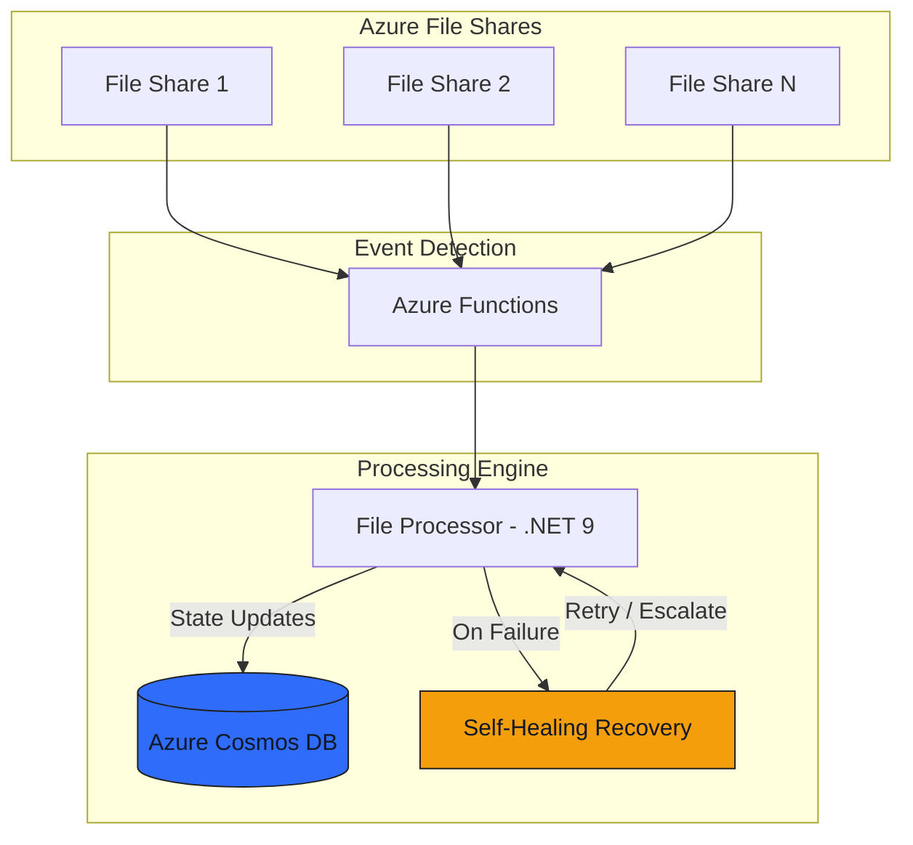

# Real-Time File Monitoring System

!!! abstract "Project Snapshot"
    **Client type:** Automotive diagnostics & operations  
    **Project type:** Real-time file monitoring and automation platform  
    **Stack:** .NET 9.0, Azure Functions, Cosmos DB, Azure File Shares, Application Insights  
    **Role:** Sole developer — architecture, build, and deployment  
    **Timeline:** Delivered and in production

## Challenge

Automotive diagnostic operations depended on real-time access to massive file repositories—over 100,000 files across distributed Azure File Shares. Manual scanning took 10–15 minutes, causing critical delays for technicians and customer service. The legacy batch approach couldn’t keep up with the scale, lacked automatic recovery from failures, and provided poor operational visibility.

## Goal

Deliver a robust, real-time file monitoring system that could instantly detect, process, and track 100,000+ files, eliminate manual intervention, and provide full operational visibility—empowering technicians with immediate access and reducing support overhead.

## System Architecture

## Approach

I architected and delivered an enterprise-grade monitoring service with intelligent Azure cloud integration, designed for scale, resilience, and real-time performance:

- **Real-time file event detection** using Azure Functions and FileSystemWatcher, eliminating polling delays.
- **Centralized state tracking** in Azure Cosmos DB, recording every file’s lifecycle with optimized partitioning for high throughput.
- **Self-healing error recovery** with automatic retries, no manual intervention required for common failures.
- **Comprehensive logging and monitoring** via Serilog and Application Insights, providing full operational visibility.
- **Production deployment** on Azure VM with enterprise-grade security.

## Key Architecture Decisions

- **Event-driven detection** for instant file discovery and processing.
- **Cosmos DB** for scalable, high-throughput state management.
- **Self-healing workflows** to minimize downtime and manual support.
- **Centralized monitoring** for operational transparency and rapid troubleshooting.

## Outcomes

- **95% faster file discovery:** Reduced from 10+ minutes to 30 seconds.
- **100,000+ files processed** with zero performance degradation.
- **1000+ file events per minute** handled during peak operations.
- **99.9% uptime** achieved through robust error handling and self-healing.
- **Near-zero detection latency:** Files processed as events occur, not on batch schedules.
- **Significant reduction in administrative overhead** and faster diagnostic turnaround times.

!!! tip "What this demonstrates"
    - Building real-time automation for high-volume, business-critical operations
    - Designing resilient, self-healing cloud architectures
    - Delivering measurable business impact through technical excellence

### Before & After

| Metric                     | Before (Batch Processing)         | After (Real-Time Service)        |
| -------------------------- | --------------------------------- | -------------------------------- |
| **Detection latency**      | 10–15 minutes (manual scan)       | 30 seconds (real-time)           |
| **Failure recovery**       | Manual investigation/reprocessing | Automatic self-healing           |
| **Operational visibility** | Manual checks per storage account | Centralized dashboard/logging    |
| **Scale**                  | Limited by scan duration          | 100,000+ files, 1000+ events/min |
| **Human intervention**     | Required for every failure        | Only for novel/persistent issues |

### Need to automate high-volume file operations?

If your business depends on fast, reliable access to large file repositories, I can help you design a real-time, resilient monitoring system that scales with your needs.

[Book a Free Strategy Call :material-arrow-top-right:](https://cal.com/jonathanduncan/free-consultation){ .md-button .md-button--primary }
[View all projects :material-arrow-right:](../index.md){ .md-button }

<small style="opacity: 0.6;">Project details shared with client permission. Some details generalized for confidentiality.</small>
